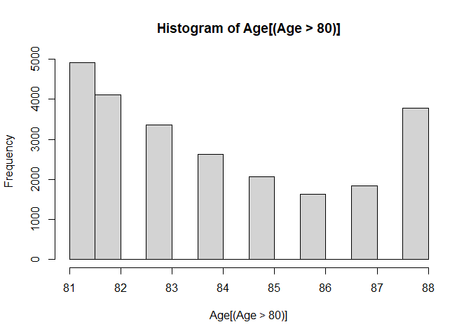

R Basics for Lecture 1 A
================

## Econ B2000, Statistics and Introduction to Econometrics

## Kevin R Foster, Colin Powell School, the City College of New York, CUNY

## Variable Coding

Some of the HouseholdPulse variables here have a natural interpretation,
for instance Age is measured in years. Actually even this has a bit of a
twist, look at the histogram.

``` r
hist(Age[ (Age > 80) ])
```

<!-- -->

There is a bit of weirdness in the right, where it looks like there are
suddenly a bunch of people who were 88 but many fewer who were 87 or 86.
This is due to a coding choice by the Census, where really old people
are labeled as “88 years old” (top-coding) but it actually should be
interpreted as meaning “88 or older”. So if you were to get finicky (and
every good statistician is!) you might go back to the calculations of
averages previously and modify them all. For instance, to select just
those who are female and who are coded as having age less than 88. Many
variables are topcoded! *And recall that topcoding wouldn’t change the
median values calculated before, which is a point in favor of that
statistic.*

``` r
mean(Age[ (Gender == "female") & (Age < 88) ]) 
```

    ## [1] 51.51615

You go make those other changes, figure out how top-coding changes the
calculations of average age by gender – I’ll wait right here…

## Variable Coding Again

So we were saying that some variables, like Age - ahem! – have a natural
interpretation as a number.

Others are logical variables (called dummies) like Gender, Race, or
Hispanic - there is a series of yes/no answers that are coded 1/0. *Note
that if you’re creating these on your own it’s good to give names that
have that sort of yes/no answer, so a variable named ‘HAS_INSURACE’
would be good, since it’s easy to remember that Yes or No answers “did
the person have insurance”. If that were labeled as ‘insurance_status’
then you’d have to remember who are coded as true and who are false.*

Dummy variables get A TON of use and the R language provides lots of
help with them – they’re called factors in the R language. Basically a
factor lumps together a bunch of 0/1 answers.

The factor, ‘Hispanic’, is a single y/n or 0/1 answer: is the respondent
Hispanic. But then Education is a whole bunch of y/n answers: is the
person’s highest completed educational level less than high school; is
the person’s highest completed educational level some high school; did
they end after getting high school diploma; etc. When you ask for a
summary of Education,

``` r
summary(Education)
```

    ##        lt hs      some hs  high school some college    assoc deg college grad 
    ##         6787        14934       122541       210698       103575       279400 
    ##   adv degree 
    ##       246855

R helpfully provides labels for each of those all together. Later when
we get into more depth, we might have to dig into the y/n answers that
are underneath.

It’s important to remember that there are some cases where the factor
values are well ordered (as with highest educational qualification)
versus others such as `State` (the state the person lives in) where
there is not necessarily an ordering. (It’s alphabetical, nothing else.)

Factors are really useful, enough that different people have developed
packages specifically to manipulate factors.

### Packages

R depends crucially on “packages” - that’s the whole reason that the
open-source works. Some statistician invents a cool new technique, then
writes up the code in R and makes it available. If you used a commercial
program you’d have to wait a decade for them to update it; in R it’s
here now. Also if somebody hacks a nicer or easier way to do stuff, they
write it up. Packages are extensions for specific tasks and you can tell
R to install specific ones. Many people who use R don’t need to create
detailed maps but if you want that, there’s a package. If you want to
analyze genetic sequences, there’s a package.

Hadley Wickham wrote ‘forcats’ for categorical data (ie factors). It’s
part of the ‘tidyverse’ package.

So enter this into the Console,

    install.packages("tidyverse")

then

``` r
library(tidyverse)
```

Alt, from R-Studio, click “Tools” then “Install Packages…” and tell it
to install the package, “tidyverse”. That is nice if you want to see
some of the packages or if you don’t quite remember the name. Then the
next piece of code, library, tells the program that you want to use
commands from this package. You only need to install once, then just put
`library()` into your code and run that part.

### Factors

R will do the summary differently when it knows the variable is a
factor,

``` r
summary(State)
```

    ##              Alabama               Alaska              Arizona 
    ##                13230                15970                26059 
    ##             Arkansas           California             Colorado 
    ##                12931                71958                24746 
    ##          Connecticut             Delaware District of Columbia 
    ##                16499                11555                13008 
    ##              Florida              Georgia               Hawaii 
    ##                33825                23538                10694 
    ##                Idaho             Illinois              Indiana 
    ##                18517                22348                17907 
    ##                 Iowa               Kansas             Kentucky 
    ##                15547                17328                14104 
    ##            Louisiana                Maine             Maryland 
    ##                12481                10524                22276 
    ##        Massachusetts             Michigan            Minnesota 
    ##                26236                26479                21160 
    ##          Mississippi             Missouri              Montana 
    ##                10391                16868                11519 
    ##             Nebraska               Nevada        New Hampshire 
    ##                15248                15658                15337 
    ##           New Jersey           New Mexico             New York 
    ##                18603                17666                18996 
    ##       North Carolina         North Dakota                 Ohio 
    ##                17425                 8649                16312 
    ##             Oklahoma               Oregon         Pennsylvania 
    ##                15025                24682                24969 
    ##         Rhode Island       South Carolina         South Dakota 
    ##                 9783                14910                 9936 
    ##            Tennessee                Texas                 Utah 
    ##                16977                49059                25831 
    ##              Vermont             Virginia           Washington 
    ##                10607                25432                37615 
    ##        West Virginia            Wisconsin              Wyoming 
    ##                11142                17272                 9958

To find mean and standard deviation of age by state, you could use
something like this,

``` r
d_HHP2020_24 %>%
  group_by(State) %>%
  summarize(
    avg = mean(Age),
    stdev = sd(Age), 
    n_obs = n()
  ) 
```

    ## # A tibble: 51 × 4
    ##    State                  avg stdev n_obs
    ##    <fct>                <dbl> <dbl> <int>
    ##  1 Alabama               52.5  16.0 13230
    ##  2 Alaska                50.9  15.8 15970
    ##  3 Arizona               54.4  16.4 26059
    ##  4 Arkansas              52.2  16.0 12931
    ##  5 California            52.0  15.9 71958
    ##  6 Colorado              51.5  16.1 24746
    ##  7 Connecticut           52.7  15.8 16499
    ##  8 Delaware              55.5  16.0 11555
    ##  9 District of Columbia  48.4  15.5 13008
    ## 10 Florida               55.7  16.0 33825
    ## # ℹ 41 more rows

Although tapply would also work fine.

Here’s the 90th and 10th percentiles of age by state, which reminds you
that there aren’t children in this sample. Then sorts by 90th
percentile.

``` r
d_HHP2020_24 %>%
  group_by(State) %>%
  summarize(
    age90th = quantile(Age,probs = 0.9),
    age10th = quantile(Age,probs = 0.1), 
    n_obs = n()
  ) %>%
  arrange(desc(age90th), .by_group = TRUE)
```

    ## # A tibble: 51 × 4
    ##    State          age90th age10th n_obs
    ##    <fct>            <dbl>   <dbl> <int>
    ##  1 Florida             76      33 33825
    ##  2 Arizona             75      31 26059
    ##  3 Delaware            75      33 11555
    ##  4 Hawaii              75      33 10694
    ##  5 New Mexico          75      33 17666
    ##  6 Maine               74      32 10524
    ##  7 Montana             74      31 11519
    ##  8 Nevada              74      32 15658
    ##  9 New Hampshire       74      32 15337
    ## 10 South Carolina      74      31 14910
    ## # ℹ 41 more rows

You could also use table (or crosstabs) for factors with fewer items,

``` r
table(Education,Gender)
```

    ##               Gender
    ## Education        male female  trans  other
    ##   lt hs          2847   3727     64    149
    ##   some hs        5752   9003     45    134
    ##   high school   48030  73467    243    801
    ##   some college  85218 123645    572   1263
    ##   assoc deg     37020  65834    145    576
    ##   college grad 122956 154321    564   1559
    ##   adv degree   108713 136467    356   1319

``` r
xtabs(~ Education + Gender)
```

    ##               Gender
    ## Education        male female  trans  other
    ##   lt hs          2847   3727     64    149
    ##   some hs        5752   9003     45    134
    ##   high school   48030  73467    243    801
    ##   some college  85218 123645    572   1263
    ##   assoc deg     37020  65834    145    576
    ##   college grad 122956 154321    564   1559
    ##   adv degree   108713 136467    356   1319

Want proportions instead of counts?

``` r
prop.table(table(Education,Gender))
```

    ##               Gender
    ## Education              male       female        trans        other
    ##   lt hs        2.890972e-03 3.784563e-03 6.498847e-05 1.513013e-04
    ##   some hs      5.840839e-03 9.142051e-03 4.569502e-05 1.360696e-04
    ##   high school  4.877182e-02 7.460169e-02 2.467531e-04 8.133714e-04
    ##   some college 8.653418e-02 1.255547e-01 5.808345e-04 1.282507e-03
    ##   assoc deg    3.759177e-02 6.685080e-02 1.472395e-04 5.848963e-04
    ##   college grad 1.248550e-01 1.567045e-01 5.727109e-04 1.583079e-03
    ##   adv degree   1.103921e-01 1.385747e-01 3.614984e-04 1.339372e-03

*Remember prop.table later when we do marginals.*

Try it and see what happens if you use table with State …

### Alt versions

In general, R is very flexible so there are often many different ways to
get the same answer. There are some people who love to debate which is
best. (Often, tradeoff between speed and intelligibility.) For now just
worry about learning at least one way. Later on you can go back and
refine your techniques.

Sometimes attaching a dataset makes things easier. But as you get more
advanced you might find it better to include the dataset name inside the
function. There are advantages and disadvantages each way and some of
the intro texts suggest one or the other.

If you do a lot of analysis on a particular subgroup, it might be
worthwhile to create a subset of that group, so that you don’t have to
always add on logical conditions. These two sets of expressions, looking
at people in the Northeast, get the same results:

``` r
mean(Age[(Region == "Northeast")])
```

    ## [1] 52.48172

``` r
# alternatively
restrict1 <- as.logical((Region == "Northeast"))
dat_northeast <- subset(d_HHP2020_24, restrict1)

detach()
attach(dat_northeast)

mean(Age)
```

    ## [1] 52.48172

``` r
detach()
```

So you detach the original data frame and instead attach the restricted
version. Then any subsequent analysis would be just done on that subset.
Just remember that you’ve done this (again, this is a good reason to
save the commands in a program so you can look back) otherwise you’ll
wonder why you suddenly don’t have southerners in the sample!

Obviously for a single restriction that might not be worthwhile but
later you might have more complicated propositions.

## Why All These Details?

You might be tired and bored by these details, but note that there are
actually important choices to be made here, even in simply defining
variables. Take the fraught American category of “race”. This data has a
variable, Race, showing how people chose to classify themselves, as
‘White,’ ‘Black,’ ‘Asian,’ or other.

In this case the Census has chosen particular values while alternate
responses go into the category of “Other”. In this case that was done
for confidentiality, just like the measures of income. Other government
data has more detail.

There’s no “right” way to do it because there’s no science in this
peculiar-but-popular concept of “race”. People’s conceptions of
themselves are fuzzy and complicated; these measures are approximations.

## Basics of government race/ethnicity classification

The US government asks questions about people’s race and ethnicity.
These categories are social constructs, which is a fancy way of pointing
out that they are based on people’s own views of themselves (influenced
by how we think that other people think of us…). Currently the standard
classification asks people separately about their “race” and “ethnicity”
where people can pick labels from each category in any combination.

The “race” categories include: “White,” “Black,” “Asian,” and others.
These represent a recent history of popular attitudes in the US. Only in
the 2000 Census did they start to classify people in mixed races. If you
were to go back to historical US Censuses from more than a century ago,
you would find that the category “race” included separate entries for
Irish and French. Stephen J Gould has a fascinating book, The Mismeasure
of Man, discussing how early scientific classifications of humans tried
to “prove” which nationalities/races/groups were the smartest. Ta-Nehisi
Coates notes, “racism invented race in America.” Throughout history,
statistics have been used to try to prove peoples’ prejudices.

Note that “Hispanic” is not “race” but rather ethnicity (sometimes
includes various other labels such as Spanish, Latino, etc.). So a
respondent could choose “Hispanic” and any race category – some choose
“White,” some choose “Black” or “Asian” or “Other”.

If you wanted to create a variable for those who report themselves as
Black and Hispanic, you’d use the expression (Race == “Black) &
(Hispanic ==”Hispanic”); sometimes government stats report for
non-Hispanic whites so (Race == “White”) & (Hispanic != “Hispanic”). You
can create your own classifications depending on what questions you’re
investigating.

The Census Bureau gives more information
[here](http://www.census.gov/newsroom/minority_links/minority_links.html).

All of these racial categories make some people uneasy: is the
government encouraging racism by recognizing these classifications? Some
other governments choose not to collect race data. But that doesn’t mean
that there are no differences, only that the government doesn’t choose
to measure any of these differences. In the US, government agencies such
as the Census and BLS don’t generally collect data on religion. And
recent news has discussed about how the US government is now insisting
that gender is binary.

### Re-Coding complicated variables from initial data

If we want more combinations of variables then we create those. Usually
a statistical analysis spends a lot of time doing this sort of
housekeeping - dull but necessary. It has a variety of names: data
carpentry, data munging…

The whole point of learning to do the data work for yourself is that you
can see all of the little decisions that go into creating a conclusion.
Some conclusions might be fragile so a tiny decision about coding could
change everything; other conclusions are robust to deviations. You must
find out.

# De-bugging

Without a doubt, programming is tough. In R or with any other program,
it is frustrating and complicated and difficult to do it the first few
times. Some days it feels like a continuous battle just to do the
simplest thing! Keep going despite that, keep working on it.

Your study group will be very helpful of course.

Often a google search of the error message helps. If you’ve isolated the
error and read the help documentation on that command, then you’re on
your way to solving the problem on your own.

If you have troubles that you can’t solve, ping me for help. But try to
narrow down your question: if you run 20 lines of code that produce an
error, is there a way to reproduce the error in just 5 lines? What if
you did the same command on much simpler data, would it still cause an
error? Sending messages like “I have a problem with errors” might be
cathartic but is not actually useful to solving the problem. If you
slack me with the minimal code that recreates the error, along with the
text of the error and/or a screenshot, then that will help more.

## Do it

The first homework assignment asks you to start working on these
questions. Begin by running the code that I give here, just to see if
you can replicate my results. Then start asking more questions about the
data - there is so much info there! Have some fun.
